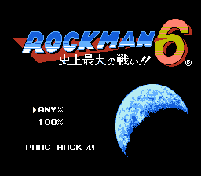
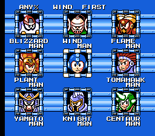
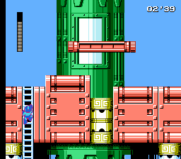

# Rockman 6 (Mega Man 6) Practice Rom Hack
This is a practice rom hack for Rockman 6 (Mega Man 6) speedrun.  
  
It has features such as display frame counter during screen transitions,  
all stages accessible from stage select, cutscene skips, etc.

## Features
- Select route (Wind/Flame/Knight first) on the stage select screen by pressing SELECT on Mega Man icon.  
- Select any stage on the stage select screen by pressing the following buttons.  
A : going to the robot master stage normally  
B : going to boss corridor of the robot master stage  
START : going to the castle stage normally  
SELECT : going to boss corridor of the castle stage  
\* castle stages are correspondingly numbered from left to right, top to bottom  
\* all stages are always available even after you beat any robot master or castle boss  
\* fun: load the "revisit" color palette by pressing A/B + D-pad for Tomahawk, Yamato, Knight and Centaur stage  
\* beta: mute BGM by pressing B on Mega Man icon (reducing lags, don't use this for individual room speedrun!)  
  
- Loading a stage gives you the appropriate weapons with the "correct" amount of ammo (for speedrun purpose)  
\* select the category (Any% or 100%) on the title screen  
  
- Show a timer in the top right corner of the screen when transitioning screens, after beat a boss, and using a teleporter (in the refights section).  
\* first number is seconds (0-99), second number is frames (0-59). functionally same as MM3-5 practice hacks'  
  
- In the robot master/castle stage, pressing SELECT will send you to the password screen and can return to the stage select or restart from the check point in the current stage.
- Skip the capcom logo, stage intro, weapon get and castle cutscenes.
- Waiting time after Mega Man's death is much shorter for faster restart.
- Infinite lives and E-tanks.
  
## Known issues
- Mute BGM will reduce lags.  
- Entering a teleporter (in the refights section), the game pauses for a bit for timer display.  
  
## Credits
I stole many asm techs from MM3-5 practice hacks to make this one.  
Huge thanks to following people for sharing very helpful info!  
- Pinkus for Mega Man 3 practice hack asm sources
- Myriachan for Mega Man 4 practice hack asm sources
- Feral for Mega Man 5 practice hack asm sources
- Raiden for Mega Man 6 disassembly
- Rock5easily for Rockman 6 analysis memo
- Puresabe for Rock6Optimization asm sources
